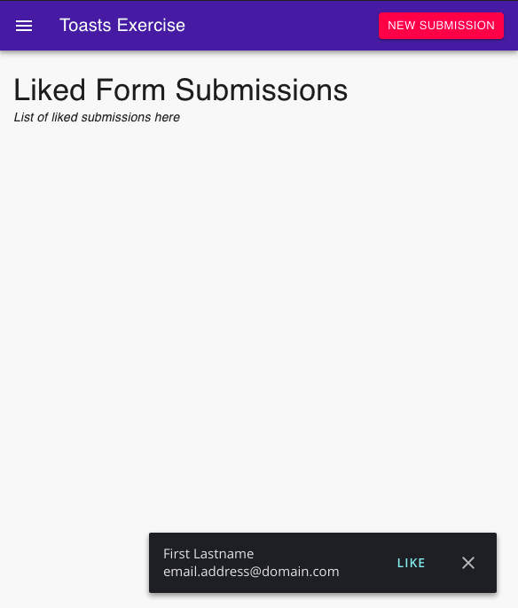

# Toast Exercise

Welcome to the toast exercise! We just got a new project from the Product team to implement
a simple toast system that notifies users when someone fills out a form they've published (a form submission).
They then can "like" the submission to have them saved on their list.

Our hope is this exercise should take around 2-4 hours.

_Please do not spend more than 4 hours._ If you do not finish, that is fine. We are
most concerned with discussing how you approached the problem and solution during the
interview.

## Setup

* Must have recent versions of `git` and `node` installed
* Use any editor or other tools

Once you have the files on your computer (after unzipping), run:

```shell
git init
npm install
npm start
```

## Exercise Overview

Take some time to familiarize yourself with this code. This was bootstrapped with `create-react-app`
and it's instructions are below if you need them.

## Requirements

* Commit often with messages to "document" your thought process and work. The more the better!
* DO NOT remove any dependencies
* DO NOT modify `src/service/mockServer.js`
* You MUST use React for your primary UI development
* You MAY add any dependency to help you
* You MAY use any CSS framework you'd like.
  * The project is scaffolded using [MUI's style system](https://mui.com/system/basics/), but is not a requirement to use.
* You MAY choose any method to store UI state
* AVOID editing `public/index.html`. Exceptions made for CSS frameworks.
* Your app MUST run with `npm start`
* (Bonus) Passing tests with `npm test`

This repo is setup to import standard `.css` files:

```js
import './my-styles.css'
```

This way, you don't have to edit the `index.html` file.

### Mock Server

A "server" is provided. Its API is detailed below.

`src/service/mockServer.js` has a few functions you will need to use.

`onMessage(callback)` is used to register a callback for when we get a new form submission from
our server. In this example, new form submissions are delivered when you hit the "New Submission"
button in the header.

`saveFormSubmission(formSubmission)` saves the submission to our "server" (localstorage). To update
a submission, you pass a full submission with the values updated. We have a flaky connection
to our database that can sometimes fail.

`fetchLikedFormSubmissions()` "fetches" the form submissions that have been liked (updated by you).
This also tends to be slow and fail at times.

## Feature Requirements

We want to have toasts show up whenever we receive a message from the server that a new client just
signed up! It should look like something like:



It doesn't have to look exact.

### Requirements

* When you click "New Submission" your app must respond and show a toast
* Toasts that are "liked" are added to the list on the page
* Toasts that are dismissed are removed and you never see them again
* When you refresh the browser, the list must persist.
* (Bonus) Any level of polish you think would make for a good UX

### Hints

* Focus on getting the core requirements down first. Then work on polish if you have time
* If you use MUI, they have a `<Snackbar>` component that can be helpful.
* We often use a polling method to get updates. You can use polling to "refresh" your
liked form submission list.

## Submitting

Please submit your code, with commit messages, to a public git repository and reply to
the recruiting emails with the link to your repository.

------------------------

Create React App README
================

This project was bootstrapped with [Create React App](https://github.com/facebook/create-react-app).

## Available Scripts

In the project directory, you can run:

### `npm start`

Runs the app in the development mode.
Open [http://localhost:3000](http://localhost:3000) to view it in the browser.

The page will reload if you make edits.
You will also see any lint errors in the console.

### `npm test`

Launches the test runner in the interactive watch mode.
See the section about [running tests](https://facebook.github.io/create-react-app/docs/running-tests) for more information.

## Learn More

You can learn more in the [Create React App documentation](https://facebook.github.io/create-react-app/docs/getting-started).

To learn React, check out the [React documentation](https://reactjs.org/).
